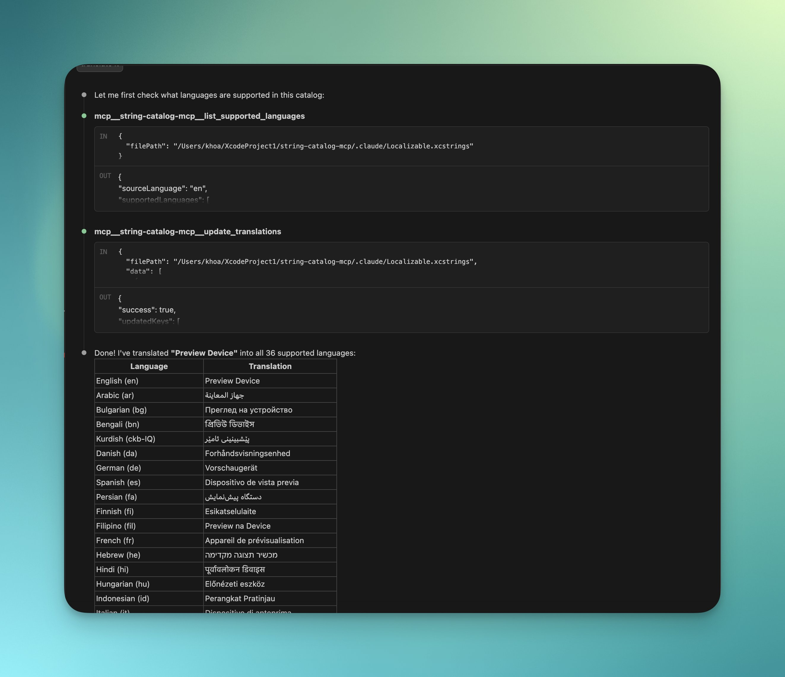

# string-catalog-mcp

An MCP server for working with Xcode String Catalog (.xcstrings) files. It lets AI assistants read, search, and update your iOS/macOS localization strings.



## Installation

```bash
pnpm install
pnpm build
```

## Usage with Claude Code

```bash
pnpm run mcp:add
```

Or manually add to your MCP config:

```json
{
  "mcpServers": {
    "string-catalog-mcp": {
      "command": "node",
      "args": ["/path/to/string-catalog-mcp/dist/index.js"]
    }
  }
}
```

---

## Available Tools

### list_supported_languages

List all languages in a string catalog with the source language identified.

> "What languages are supported in my Localizable.xcstrings file?"

---

### get_catalog_statistics

Get translation coverage breakdown per language, including total keys and completion percentages.

> "Show me the translation statistics for my string catalog"

---

### get_translations_for_key

Get all translations for a specific key across all supported languages.

> "Show me all translations for the 'welcome_message' key"

---

### search_keys

Search for localization keys containing a specific substring (case-insensitive).

> "Find all keys that contain 'error' in my string catalog"

---

### list_all_keys

List all localization keys in the catalog (supports pagination for large catalogs).

> "List all the localization keys in my project"

---

### update_translations

Add or update translations in the string catalog. Accepts a structured JSON payload with support for iOS format placeholders (`%@`, `%d`, `%lld`, `%f`, `%1$@`).

> "Add German and French translations for the 'hello_world' key"

---

## Available Prompts

### translate-strings

Generate translations for specific keys with guidance on format placeholders.

> "Use the translate-strings prompt to translate 'welcome_message' and 'goodbye' into German, French, and Japanese"

### batch-translate

Translate all untranslated or stale strings in a catalog for specified languages.

> "Use batch-translate to add German translations for all missing strings in my catalog"

### review-translations

Review existing translations for quality, consistency, and proper placeholder usage.

> "Review my German translations for quality issues"

## Common Workflows

### Add a new language to your app

1. "What languages are supported in my Localizable.xcstrings?"
2. "Use batch-translate to add Spanish translations to /path/to/Localizable.xcstrings"

### Translate specific strings

1. "Search for keys containing 'settings' in my string catalog"
2. "Show me translations for the 'settings_title' key"
3. "Translate 'settings_title' and 'settings_description' into German and French"

### Review translation quality

1. "Show me translation statistics for my catalog"
2. "Review German translations for placeholder issues and consistency"

---

## License

MIT
